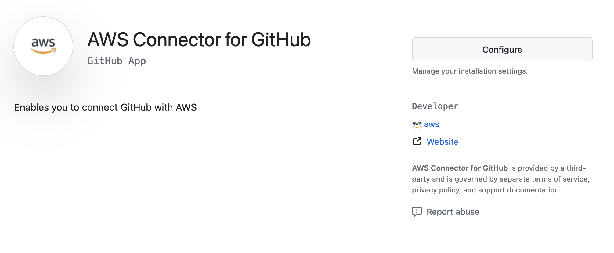
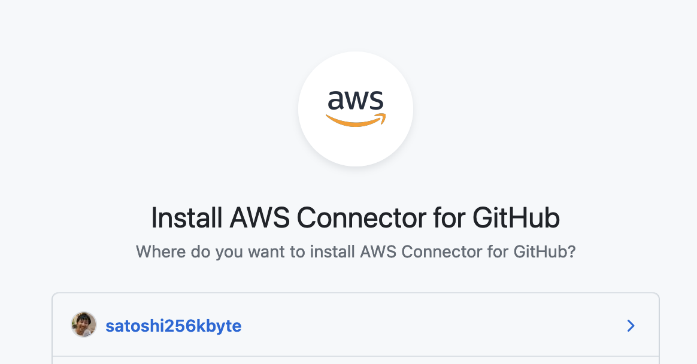
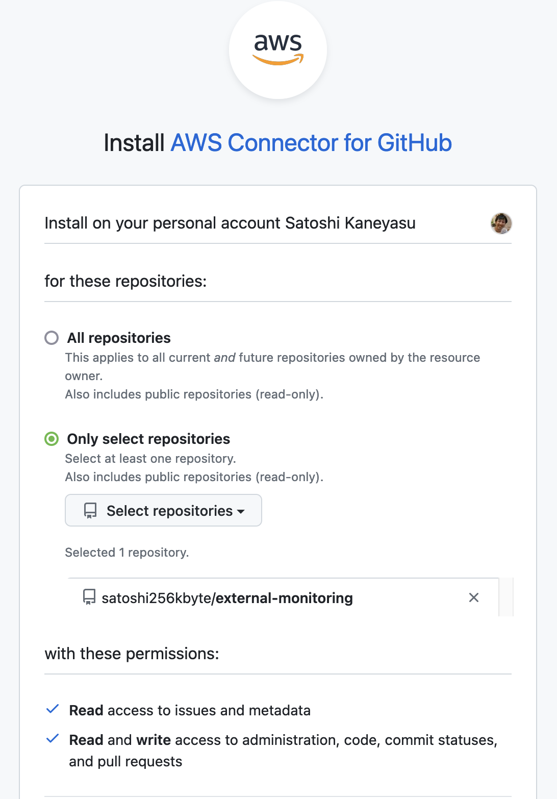
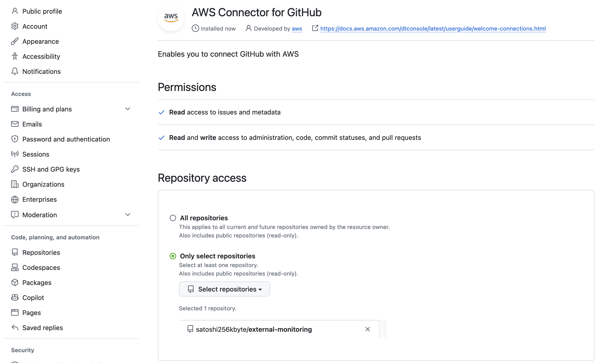

# FastAPIとAmazon Aurora Serverless V2を使った外形監視アプリ

## 概要

このアプリケーションは、FastAPIとAmazon Aurora Serverless V2を使った外形監視アプリです。

## 使用方法

### 事前準備

cfnディレクトリ配下のCloudFormationテンプレートを使って、AWSリソースを作成します。

1. vpc.yml
2. db.yml

本プログラムは、AWS App Runnerで稼働させることを想定しています。
App Runnerと本リポジトリを接続することでデプロイします。

## 開発

### 依存ライブラリのインストール

```bash
pipenv install --dev
```
Pipfile.lock が作成されるので、Gitの管理対象としてCommitする必要有り。

### ユニットテストの実行
tests/unit/test_handler.pyに定義されたテストの実行
（以下コマンド実行前に$ pipenv shellで仮想環境に入る必要あり）

```bash
pipenv run pytest -v -s
```

### コードフォーマットの実行（コードの自動整形）
isortとblackを使用。isortはblackが対応していないimport文の並び替えなどを行う。
（以下コマンド実行前に$ pipenv shellで仮想環境に入る必要あり）

```
pipenv run format
```

### Lintの実行(PEP8にもとづくコードの静的解析)
（以下コマンド実行前に$ pipenv shellで仮想環境に入る必要あり）

```
pipenv run lint
```

### ローカル実行

環境変数を`.env`ファイルに記述してください。

```bash
cp .env.sample .env
vi .env
```

`uvicorn`コマンドでFastAPIアプリケーションを起動します。

```bash
 uvicorn app.main:app --reload --port 8080 --env-file .env
```

## AWSへのデプロイ

AWS App Runnerでデプロイします。

### デプロイ方式にソースコードリポジトリを使用する場合

apprunner.yamlを作成しているのでそれを使用します。

AWS Connector for GitHubをインストールします。
GitHub側に[AWS Connector for GitHub](https://github.com/apps/aws-connector-for-github)をインストールします。  
  
`Configure`をクリックします。



アカウントを選択します。



デプロイ対象になり得るリポジトリを選択し、`Install`をクリックします。
インストール後に画面上JSONエラーが出る時があるようです、それでもインストール自体はできるようなので設定画面で確認してください。

  
  
インストール後は、GitHubの設定画面にAWS Connector for GitHubが表示されます。




### デプロイ方式にAWS ECRを使用する場合  
  
Dockerfileでビルドでして、AWS ECRへのアップしてからApp Runnerサービスを作成します。

#### AWS ECR へログイン

```bash
aws ecr get-login-password --region ap-northeast-1 | docker login --username AWS --password-stdin {AWSアカウントNo}.dkr.ecr.ap-northeast-1.amazonaws.com
```

#### Docker イメージをビルド

```bash
docker build -t mimosa-{ステージ名}-ecr-crawler .
```

#### イメージにタグを設定

```bash
docker tag mimosa-loc-ecr-crawler:latest {AWSアカウントNo}.dkr.ecr.ap-northeast-1.amazonaws.com/mimosa-{ステージ名}-ecr-crawler:latest
```

#### イメージを AWS ECR にプッシュ

```bash
docker push {AWSアカウントNo}.dkr.ecr.ap-northeast-1.amazonaws.com/mimosa-{ステージ名}-ecr-crawler:latest
```

## メモ

CFnでRDSを作る時のEngineVersionの選択肢を確認するコマンド

```bash
aws rds describe-db-engine-versions --engine aurora-mysql --query 'DBEngineVersions[].EngineVersion'
```

CFnでRDSを作る時のDBInstanceClassの選択肢を確認するコマンド

```bash
aws rds describe-orderable-db-instance-options --engine aurora --query 'OrderableDBInstanceOptions[*].DBInstanceClass' --output text
```

AWS Secrets Managerからシークレットを取得するコマンド

```bash
aws secretsmanager get-secret-value --secret-id '{シークレットIDまたはシークレット名}'
```

RDS Proxyの状態を確認するコマンド

```bash
aws rds describe-db-proxy-targets --db-proxy-name {プロキシ識別子}
```

`"Description": "DBProxy Target is waiting for proxy to scale to desired capacity"`の場合は、プロキシのスケーリングが完了していません。
この状態を抜けないと成否は不明です。
1時間程度かかることがあります。

